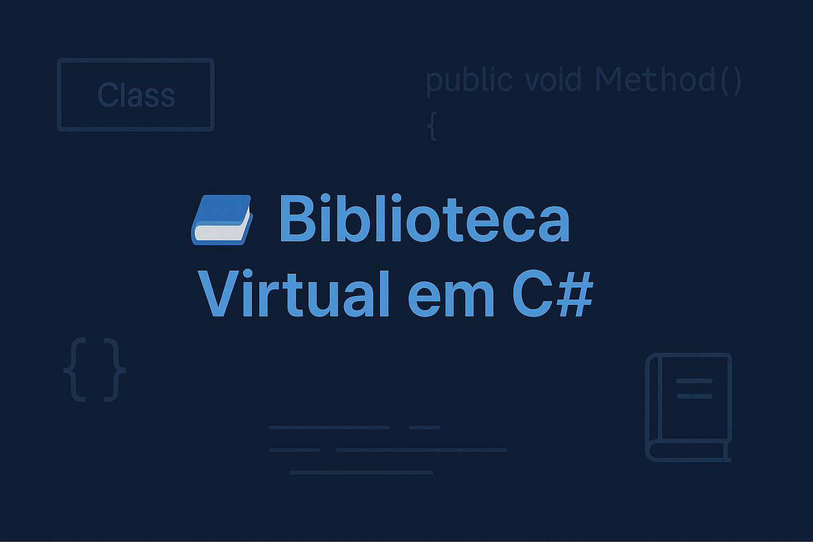

# 📚 Biblioteca Virtual em C# (Console App)

Este projeto é um sistema de **gerenciamento de biblioteca** feito em **C# com interface de console**, utilizando conceitos de **Programação Orientada a Objetos (POO)** e salvamento de dados em **arquivos `.json`** com o pacote `Newtonsoft.Json`.

---

## 🎯 Funcionalidades

- Cadastro de Autores
- Cadastro de Usuários
- Cadastro de Livros (relacionando com autores)
- Realização de empréstimos de livros
- Devolução de livros
- Listagem de livros disponíveis
- Listagem de empréstimos (ativos e concluídos)
- Persistência de dados em arquivos `.json`

---

## 🛠️ Tecnologias Utilizadas

- Linguagem: **C#**
- Projeto: **.NET Console Application**
- Serialização JSON: `Newtonsoft.Json`
- Armazenamento: arquivos `.json` locais (simula banco de dados)
- Estilo de codificação: POO com repositórios

---

## ⚙️ Como Executar o Projeto

1. Clone o repositório:

```bash
git clone https://github.com/MarceloCjrr/biblioteca-console-csharp.git
